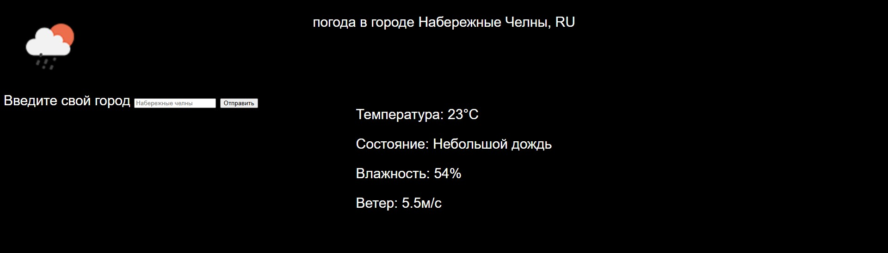

# Weather Project 🌤️

Простое веб-приложение для отображения текущей погоды в любом городе.

## Возможности
- Поиск погоды по названию города
- Отображение температуры, влажности и описания погоды
- Адаптивный дизайн для мобильных устройств и компьютеров
- Использование актуальных данных с OpenWeatherMap API

## Технологии
- HTML
- CSS
- JavaScript (Vanilla)
- OpenWeatherMap API

## Как запустить
1. Клонируйте репозиторий
2. Откройте файл `main.html` в любом современном браузере
3. Введите название города в поле поиска

## Скриншоты

## Планы по улучшению
- Интеграция с геолокацией
- Темная тема

## Контакты
Если у вас есть вопросы или предложения, свяжитесь со мной через Telegram: @veocat
